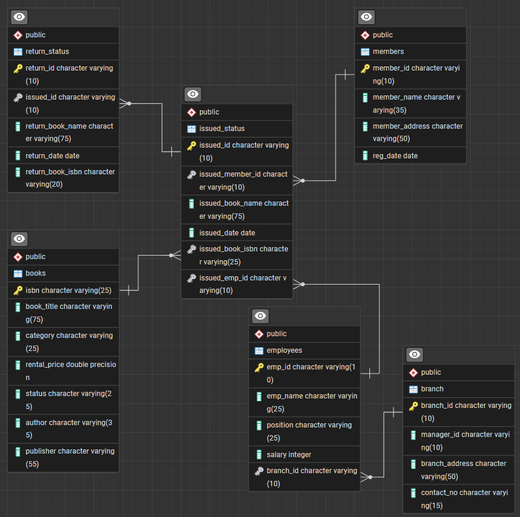

# 📚 Library Management System (LMS) — SQL Project

## 📌 Project Overview
This project implements a **Library Management System (LMS)** using **SQL** to model, manage, and analyze library operations.  
It demonstrates **relational database design**, **CRUD operations**, **advanced SQL queries**, and **business-focused analytical reporting**.

The system supports:
- Book inventory management
- Member registration
- Book issue & return tracking
- Employee and branch operations
- Revenue and performance analysis

---

## 🏗️ Entity Relationship Diagram (ERD)

The following ERD illustrates the complete relational structure of the database, including **primary keys**, **foreign keys**, and table relationships.

---

## 🗄️ Database Schema Overview

### 📍 Core Tables
- **branch** – Stores branch details and manager information  
- **employees** – Maintains employee records and branch assignments  
- **books** – Contains book metadata including category, rental price, author, and availability  
- **members** – Tracks registered library members  
- **issued_status** – Records all book issue transactions  
- **return_status** – Captures book return details  

### 🔑 Key Relationships
- Each **employee** belongs to one **branch**
- Each **book issue** links to a **member**, **book**, and **employee**
- Each **return** references a corresponding **issue**
- Referential integrity is enforced using **foreign key constraints**

---

## ⚙️ Functional Capabilities

### 🔹 CRUD Operations
- Insert new books into inventory
- Update member details
- Delete issued records
- Retrieve books issued by a specific employee

### 🔹 Aggregations & Grouping
- Identify members who issued more than one book
- Calculate total rental income by category
- Generate issue summaries using **CTAS (Create Table As Select)**

### 🔹 Advanced SQL Techniques
- `GROUP BY` and `HAVING`
- `INNER JOIN`, `LEFT JOIN`, and self-joins
- `NOT IN` vs `LEFT JOIN … IS NULL`
- Date arithmetic and interval handling
- Common Table Expressions (CTEs)
- Analytical summary tables

---

## 📊 Data Analysis & Key Queries

### 📘 Book & Category Insights
- Identified high-performing book categories
- Calculated rental revenue contribution by category
- Flagged high-priced books using threshold-based filtering

### 👥 Member Insights
- Tracked recently registered members (last 180 days)
- Identified frequent borrowers
- Detected members with **overdue books** using dataset-based “as-of” logic

### 🔄 Issue & Return Analysis
- Listed books not yet returned
- Compared issued vs returned books
- Evaluated employee contribution to issue processing

---

## 🏢 Branch & Employee Performance

### Branch Performance Report
A summary table was generated showing:
- Total books issued
- Total books returned
- Total rental revenue per branch

This enables **branch-level performance comparison** and operational oversight.

### Top Employees
- Identified the **top 3 employees** who processed the highest number of book issues
- Displayed employee name, branch, and issue count

---

## 📈 Key Findings
- A small subset of employees handles a large portion of transactions
- Certain book categories generate disproportionately higher revenue
- Overdue books can be systematically identified using date-driven logic
- Branch-level performance varies significantly in revenue and activity
- Pre-aggregated CTAS tables improve reporting efficiency

---

## 🧠 Business Decisions Enabled
- Optimizing book inventory by demand
- Recognizing high-performing employees
- Improving overdue recovery strategies
- Allocating resources across branches
- Adjusting rental pricing policies

---

## 🚀 Future Enhancements
- Overdue fine calculation
- Book reservations and waitlists
- Real-time availability tracking
- Role-based access control
- BI dashboards (Power BI / Tableau)
- Automated overdue notifications

---

## 🛠️ Technologies Used
- SQL (PostgreSQL compatible)
- Relational Database Design
- Data Analysis & Reporting

---

## 📎 Conclusion
This project demonstrates strong proficiency in **SQL, relational modeling, and analytical problem-solving**.  
It mirrors real-world business use cases and highlights how structured data enables **data-driven decisions**.

---

👤 **Author:** Kaushlendra Kumar Verma  
🎓 MS in Business Analytics  
📍 Chandler, AZ
